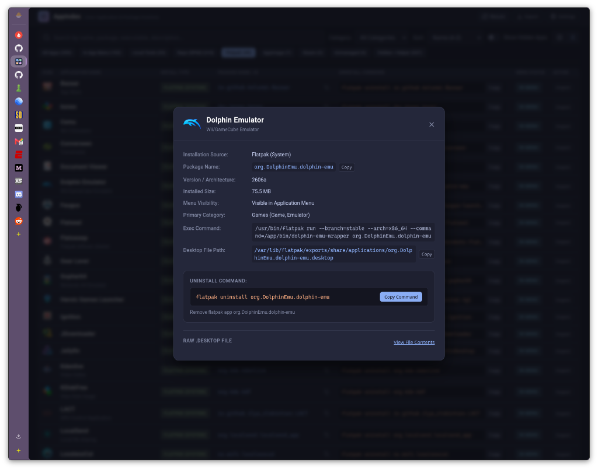

# AppIndex

Universal Linux Application & Package Inventory Inspector

AppIndex is a lightweight, local web dashboard and system inspector that inventories all applications installed across your Linux system. It automatically discovers, classifies, and manages applications across diverse packaging ecosystems, attributing each application to its underlying package manager or installation source, displaying exact package identifiers, and providing one-click copyable uninstall commands.

---

## Screenshots

### Table View


### Card Grid View


### Application Inspector


### Customizable Export


---

## Supported Package Formats & Sources

AppIndex automatically scans and classifies applications from across all major Linux distribution channels:

### 1. Flatpaks (System & User)
- Discovers Flatpak packages from both System (`/var/lib/flatpak`) and User (`~/.local/share/flatpak`) scopes.
- Cross-references exports with `flatpak list` to extract application IDs, branch versions (e.g. `stable`), and installed disk footprints.
- Generates exact removal commands: `flatpak uninstall <app_id>` or `flatpak uninstall --user <app_id>`.

### 2. AppImages
- Detects standalone AppImage binaries located in standard directories like `~/Applications` or invoked from custom desktop files.
- Automatically discovers unindexed executable binaries placed in `~/Applications` and creates inventory records.
- Provides direct removal commands that clean up both the portable binary and any associated menu entries.

### 3. Native Distribution Repositories
AppIndex automatically detects your host distribution via `/etc/os-release` and queries the appropriate native package manager database:
- **Fedora / Nobara / RHEL / CentOS (RPM & DNF)**: Queries the native RPM database via Python bindings or `rpm -qf` to retrieve package names, versions, architectures, and install sizes, generating `sudo dnf remove <package>`.
- **openSUSE / SUSE (RPM & Zypper)**: Identifies RPM-managed packages on openSUSE systems, generating `sudo zypper rm <package>`.
- **Arch Linux / Manjaro / EndeavourOS (Pacman)**: Queries file ownership via `pacman -Qo` to resolve package identities and versions, generating `sudo pacman -R <package>`.
- **Debian / Ubuntu / Linux Mint / Pop!_OS (APT & DPKG)**: Queries `dpkg -S` and `dpkg-query` to resolve owning Debian packages and install sizes, generating `sudo apt remove <package>`.

### 4. Steam Games & Proton Titles
- Parses Steam application desktop entries (`steam://rungameid/<id>`).
- Extracts game IDs and provides native Steam uninstall triggers (`steam steam://uninstall/<id>`).

### 5. Progressive Web Apps (PWAs)
- Detects website shortcuts and Progressive Web Apps launched via Google Chrome, Brave, Microsoft Edge, and Mozilla Firefox (`--app=`, `--app-id=`, WebApp entries).
- Provides one-click commands to remove obsolete web shortcuts.

### 6. Local User Tools & Scripts
- Indexes custom scripts and internal utilities registered in `~/.local/share/applications/`.
- Accurately identifies user overrides that customize system or Flatpak applications, linking them back to the underlying package while noting the local customization.

### 7. Unmanaged
- Catches compiled software (`make install`), manual extractions in `/opt` or `/usr/local`, and standalone binaries not registered with any system package manager.

---

## Key Features

- **Freedesktop XDG Specification Compliance**: Fully implements directory precedence (`~/.local/share/applications` > `/var/lib/flatpak/exports` > `/usr/share/applications`) to deduplicate launchers and correctly identify user overrides.
- **Dynamic Desktop Environment Detection**: Evaluates `OnlyShowIn` and `NotShowIn` against `$XDG_CURRENT_DESKTOP` to accurately reflect app menu visibility on KDE Plasma, GNOME, XFCE, Cinnamon, MATE, and window managers.
- **Copyable Commands**: One-click clipboard copy for exact package identifiers and root uninstall commands.
- **Dual Presentation**: Toggle between a dense, sorting-capable Data Table and a responsive Card Grid.
- **Helper & Daemon Filtering**: Toolbar toggle to show or hide background daemons, system services, and utilities marked `NoDisplay=true`.
- **Real-Time Search & Category Filters**: Multi-field search by name, package ID, binary path, comment, or desktop file with instant filtering.
- **Theme & Appearance Engine**:
  - 7 Built-in Themes: Catppuccin Macchiato, Tokyo Night, Nord, Gruvbox Dark, Dracula, Cyberpunk, and Clean Light.
  - Custom Theme Editor: Real-time color customizer with save and delete capability.
  - View Density Controls: Compact, Standard, and Spacious layout spacing.
  - Font Scaling: Interactive font slider from 80% to 130%.
  - Zero-FOUC persistence in browser local storage.
- **Export Formats**: Download complete inventory reports in CSV or JSON formats.

---

## Requirements

- Python 3.9+
- Linux (compatible with any distribution: Fedora, Nobara, Arch Linux, Ubuntu, Debian, openSUSE, etc.)
- Python packages:
  - `fastapi`
  - `uvicorn`
  - `pyxdg`
  - `rpm` (optional, for accelerated RPM queries on RPM-based distributions)

---

## Installation & Running

### 1. Clone the Repository

```bash
git clone https://github.com/PlasmaDrifter/AppIndex.git
cd AppIndex
```

### 2. Install Dependencies

**On Fedora / Nobara / RHEL / CentOS**:
```bash
sudo dnf install python3-fastapi python3-uvicorn python3-pyxdg python3-rpm python3-pillow
```

**On Arch Linux / Manjaro / EndeavourOS**:
```bash
sudo pacman -S python-fastapi python-uvicorn python-pyxdg python-pillow
```

**On Debian / Ubuntu / Linux Mint / Pop!_OS**:
```bash
sudo apt install python3-fastapi python3-uvicorn python3-xdg python3-pil
```

Alternatively, using pip:
```bash
pip install fastapi uvicorn pyxdg pillow
```

### 3. Launch AppIndex

You can launch AppIndex directly using the bundled launcher script:

```bash
./appindex.sh
```

This starts the backend server in the background (if not already running) and opens your default browser at `http://localhost:8765`.

To run the server in the foreground instead:
```bash
python3 server.py --host 127.0.0.1 --port 8765
```

---

## Command-Line & Desktop Launcher Setup

AppIndex comes with an included portable launcher script (`appindex.sh`). You can symlink it to your personal `~/.local/bin` directory (or any directory in your `$PATH`):

```bash
# Link the launcher into ~/.local/bin
mkdir -p ~/.local/bin
ln -sf "$(pwd)/appindex.sh" ~/.local/bin/appindex
```

The script supports standard commands:
```bash
appindex          # Ensure server is running and open in browser (default)
appindex start    # Start server in background if not running
appindex stop     # Stop the background server
appindex restart  # Restart the server with fresh code/settings
appindex open     # Open browser to http://localhost:8765
appindex status   # Check server health
appindex scan     # Trigger a fresh rescan via API
appindex update   # Automatically update AppIndex to latest release and restart
```

### Desktop Menu Entry

To integrate AppIndex into your application launcher (KDE, GNOME, XFCE, etc.), create `~/.local/share/applications/appindex.desktop`:

```ini
[Desktop Entry]
Type=Application
Name=AppIndex
GenericName=Linux Application & Package Inventory
Comment=Inspect installed applications, package managers, and uninstall commands
Exec=appindex
Icon=utilities-terminal
Terminal=false
Categories=Utility;System;
Keywords=apps;packages;inventory;uninstall;flatpak;appimage;rpm;pacman;apt;steam;pwa;
```

*(Note: If you did not symlink `appindex` to `~/.local/bin`, set `Exec` to the absolute path of `appindex.sh` in your clone directory, e.g., `Exec=/path/to/AppIndex/appindex.sh launch`)*

---

## Optional: Systemd User Service Setup

If you prefer to have AppIndex running permanently in the background as a user service:

1. Create `~/.config/systemd/user/appindex.service`:

```ini
[Unit]
Description=AppIndex Web Service
After=network.target

[Service]
Type=simple
WorkingDirectory=%h/path/to/AppIndex
ExecStart=/usr/bin/python3 %h/path/to/AppIndex/server.py --port 8765
Restart=on-failure
RestartSec=3

[Install]
WantedBy=default.target
```
*(Replace `%h/path/to/AppIndex` with the path where you cloned the repository; `%h` expands automatically to your home directory)*

2. Reload systemd and enable the service:

```bash
systemctl --user daemon-reload
systemctl --user enable --now appindex.service
```

---

## REST API Reference

| Endpoint | Method | Description |
| :--- | :--- | :--- |
| `/api/apps` | `GET` | Returns list of all scanned applications, package metadata, and summary stats |
| `/api/icon?name=<icon_name>` | `GET` | Resolves and serves application icons via XDG theme lookup |
| `/api/desktop-content?path=<path>` | `GET` | Returns raw text content of a local `.desktop` file |
| `/api/refresh` | `POST` | Invalidates in-memory cache and triggers a full system rescan |
| `/api/export?format=csv\|json&fields=...&sources=...&visibility=...` | `GET` | Downloads catalog as a CSV or JSON file with optional column, package source, and visibility filters |
| `/favicon.ico` | `GET`, `HEAD` | Serves application favicon |

---

## Running Tests

AppIndex includes a unit and integration test suite:

```bash
python3 test_scanner.py
```

---

## License

This project is open source and available under the [MIT License](LICENSE).
