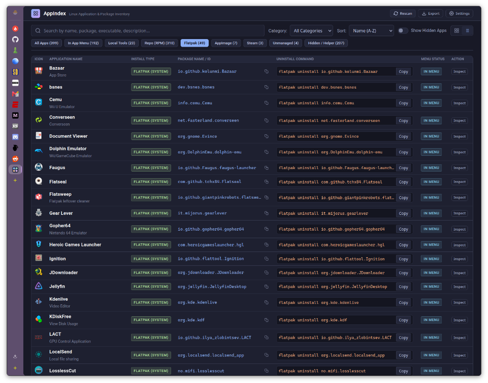
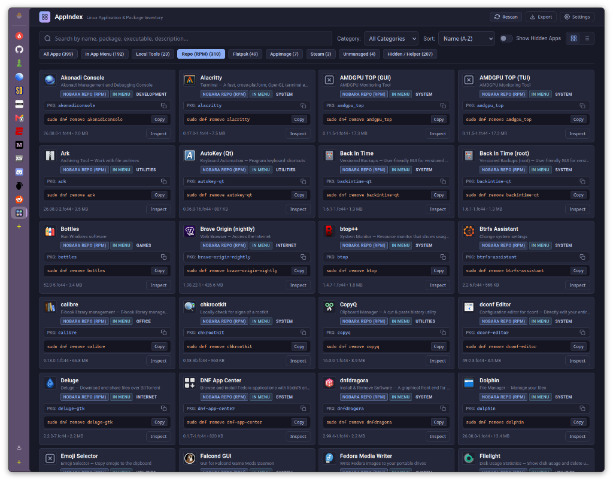

# AppIndex

Linux Application & Package Inventory Inspector

AppIndex is a lightweight, local web dashboard and system inspector that inventories all applications installed across your Linux system. It parses XDG desktop entries, attributes each application to its underlying package manager or installation source, displays exact package identifiers, and provides one-click copyable uninstall commands.

## Screenshots

### Table View


### Card Grid View


## Key Features

- **Multi-Source Detection**: Accurately classifies applications by their installation origin:
  - Fedora & Nobara Repositories (RPM / DNF) via native RPM database querying
  - Flatpak packages (System and User scopes) via Flatpak exports and runtime lists
  - Standalone portable executables (AppImages in `~/Applications` or custom paths)
  - Steam Games and custom shortcuts (`steam://rungameid/<id>`)
  - Local User Tools and custom shell scripts (`~/.local/share/applications`)
  - Chrome, Brave, and Firefox Web Apps (PWAs)
  - Unmanaged system binaries not owned by package managers
- **XDG Specification Compliance**: Fully implements XDG desktop file directory precedence (`~/.local/share/applications` > `/var/lib/flatpak/exports` > `/usr/share/applications`) to deduplicate launchers when custom icons or local overrides exist.
- **Copyable Uninstall Commands**: Direct one-click copy buttons for both package IDs and exact uninstall commands (e.g. `sudo dnf remove <package>`, `flatpak uninstall <id>`, or standalone removal paths).
- **Default Table & Card Views**: Switch between a compact data table view and a card grid.
- **Show / Hide System Helpers**: Toolbar toggle to easily filter out background daemons, terminal helpers, and utility entries marked `NoDisplay=true`.
- **Search & Categorization**: Real-time multi-field search (by app name, package name, executable binary, description, or desktop filename) alongside category filtering.
- **Customization & Theme Engine**:
  - 7 Built-in Theme Presets: Catppuccin Macchiato (default), Tokyo Night, Nord, Gruvbox Dark, Dracula, Cyberpunk, and Clean Light.
  - Live Theme Builder: Fine-tune individual color elements (Background, Card, Surface, Borders, Text, Accents) with real-time preview and custom theme saving.
  - View Density Control: Switch between Compact, Standard, and Spacious layout spacing.
  - Font Size Scaling: Interactive slider and presets to scale typography from 80% to 130%.
  - Zero-FOUC Local Storage: All settings persist immediately in browser local storage.
- **Export Formats**: One-click export of complete application catalogs to JSON or CSV.

---

## Requirements

- Python 3.9+
- Linux (tested on Nobara, Fedora, RHEL, openSUSE, Arch, and Debian/Ubuntu)
- Python packages:
  - `fastapi`
  - `uvicorn`
  - `pyxdg`
  - `rpm` (standard system package `python3-rpm` on RPM-based distributions)

---

## Installation & Running

### 1. Clone the Repository

```bash
git clone https://github.com/PlasmaDrifter/AppIndex.git
cd AppIndex
```

### 2. Install Dependencies

On Fedora / Nobara / RHEL:
```bash
sudo dnf install python3-fastapi python3-uvicorn python3-pyxdg python3-rpm
```

Alternatively, using pip:
```bash
pip install fastapi uvicorn pyxdg
```

### 3. Run Manually

```bash
python3 server.py --host 127.0.0.1 --port 8765
```

Open `http://localhost:8765` in your browser.

---

## Systemd User Service Setup

To run AppIndex seamlessly in the background as a user service:

1. Create a service file at `~/.config/systemd/user/appindex.service`:

```ini
[Unit]
Description=AppIndex Web Service
After=network.target

[Service]
Type=simple
WorkingDirectory=/home/jmc/Source/AppIndex
ExecStart=/usr/bin/python3 /home/jmc/Source/AppIndex/server.py --port 8765
Restart=on-failure
RestartSec=3

[Install]
WantedBy=default.target
```

2. Reload systemd and enable the service:

```bash
systemctl --user daemon-reload
systemctl --user enable --now appindex.service
```

---

## Desktop Menu Launcher

To launch AppIndex directly from your KDE, GNOME, or XFCE application menu:

1. Create launcher script at `~/Scripts/appindex.sh`:

```bash
#!/bin/bash
PORT=8765
URL="http://127.0.0.1:${PORT}"

# Ensure service is active or start it
systemctl --user start appindex.service 2>/dev/null || nohup python3 /home/jmc/Source/AppIndex/server.py --port $PORT >/dev/null 2>&1 &

# Open in default web browser
xdg-open "$URL"
```
Make it executable: `chmod +x ~/Scripts/appindex.sh`

2. Create desktop entry at `~/.local/share/applications/appindex.desktop`:

```ini
[Desktop Entry]
Type=Application
Name=AppIndex
GenericName=Linux Application & Package Inventory
Comment=Inspect installed applications, package managers, and uninstall commands
Exec=/home/jmc/Scripts/appindex.sh
Icon=/home/jmc/Source/AppIndex/static/icon.svg
Terminal=false
Categories=System;Utility;
Keywords=apps;packages;inventory;uninstall;flatpak;rpm;
```

---

## REST API Reference

| Endpoint | Method | Description |
| :--- | :--- | :--- |
| `/api/apps` | `GET` | Returns list of all scanned applications and summary metrics |
| `/api/icon?name=<icon_name>` | `GET` | Resolves and serves application icons via XDG theme lookup |
| `/api/desktop-content?path=<path>` | `GET` | Returns raw text content of a local `.desktop` file |
| `/api/refresh` | `POST` | Invalidates in-memory cache and triggers a full system rescan |
| `/api/export?format=csv\|json` | `GET` | Downloads catalog as a CSV or JSON file |

---

## Running Tests

AppIndex includes a unit and integration test suite:

```bash
python3 test_scanner.py
```

---

## License

This project is open source and available under the [MIT License](LICENSE).
